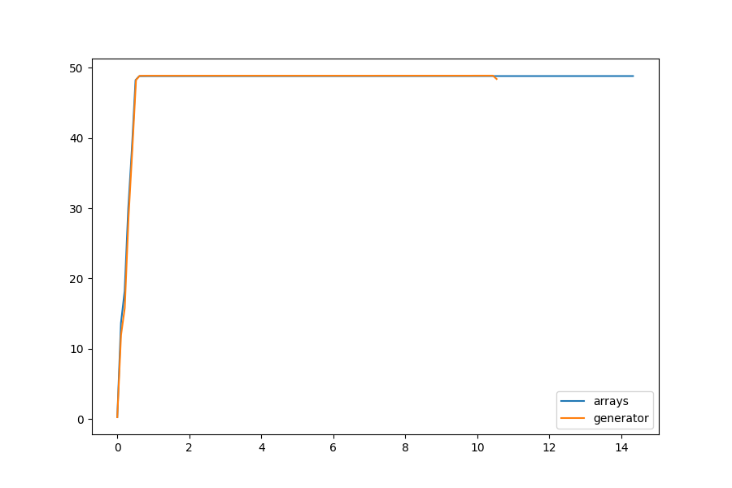

.. -*- mode: rst -*-

Neighborhoods
=============

Most of the computational complexity from the Game of Life Cellular Automata comes from computing the next step in the simulation. This requires looping over all cells in the current frame and updating their state based on their *neighborhood*. In order to determine the neighborhood, another small loop is required to find the values of all cells surrounding the current cell and to sum their results. Each frame is a numpy 2-dimensional array wrapped with some helper utilities using a :class:`~fastlife.grid.Grid` object. This object exposes three methods to access the neighborhood:

- :func:`~fastlife.grid.Grid.neighborhood`: uses Python generators
- :func:`~fastlife.grid.Grid.neighborhood_array`: creates and returns a numpy array
- :func:`~fastlife.grid.Grid.neighborhood_sum`: computes the sum directly

.. NOTE::

    We found that the :func:`~fastlife.grid.Grid.neighborhood_sum` method was the fastest performing mechanism and this is the Grid method that the simulation currently uses.

The ``neighborhood`` method returns the value of the cells surrounding the cell at the ``i,j`` coordinates using either a Von Neumann or Moore (default) neighborhood. This method must return the values in a specific order, namely, starting from the top at the 12 o'clock position in clockwise order. We wanted to keep the order static so that callers could infer which position each returned value was, therefore rather than range from ``(-1, 1)``, the index positions were statically stored as follows:

.. code-block:: python

    VNIP = np.asarray([-1, 0, 1, 0])
    VNJP = np.asarray([0, 1, 0, -1])
    MRIP = np.asarray([-1, -1, 0, 1, 1, 1, 0, -1])
    MRJP = np.asarray([0, 1, 1, 1, 0, -1, -1, -1])

Here the ``"VN"`` prefix refers to the Von Neumann neighborhood and the ``"MR"`` prefix refers to the Moore neighborhood. At their core, each of the methods simply loops over the ``i,j`` indices of the neighborhood values using the deltas in these arrays to find the values and returns them.

Comparing the memory usage of generators (the ``neighborhood`` and ``neighborhood_sum`` methods) to arrays (``neighborhood_array``) showed that they used equivalent amounts of memory for decently sized programs:

Therefore we turned to ``cProfile`` to determine the stack performance of the methods instead. The below sections describe each method in detail and their results.

Generators
----------

The generator method loops through the positions in the neighborhood and attempts to fetch their value, catching an ``IndexError`` if it is out of bounds. The function yields the result, which causes Python to return a ``generator`` which can be looped over by callers.

.. code-block:: python

    def neighborhood(self, i, j):
        ip, jp = (MRIP, MRJP) if self.adjacency == MOORE else (VNIP, VNJP)

        for id, jd in zip(ip, jp):
            try:
                yield self._world[i+id,j+jd]
            except IndexError:
                yield 0

The simulation must sum all of the values yielded by the generator and can do so by using the built-in ``sum`` function:

.. code-block:: python

    ngbrs = sum(cframe.neighborhood(i,j))

Resulted in the following profile:

.. code-block:: none

            168826452 function calls (168826408 primitive calls) in 185.587 seconds

      Ordered by: cumulative time
      List reduced from 345 to 20 due to restriction <20>

      ncalls  tottime  percall  cumtime  percall filename:lineno(function)
           1    0.000    0.000  185.586  185.586 sequential.py:106(run)
         150   30.499    0.203  185.543    1.237 sequential.py:75(step)
     9375304   49.018    0.000  133.994    0.000 {built-in method builtins.sum}
    84375000   83.697    0.000   84.966    0.000 grid.py:72(neighborhood)
     9375055    9.608    0.000   12.357    0.000 grid.py:118(__setitem__)
     9375000    6.620    0.000    8.705    0.000 grid.py:113(__getitem__)
    28125453    3.168    0.000    3.168    0.000 {built-in method builtins.isinstance}
    18750560    1.666    0.000    1.666    0.000 {built-in method builtins.len}
     9375000    1.270    0.000    1.270    0.000 grid.py:57(adjacency)

Approximately 26% of the time of this program was spent in the ``builtins.sum`` method, and 45% of the time spent in the `neighborhood` function. This was an interesting result in that it balanced the summation and the loops fairly well.

Arrays
------

The goal of the arrays method was to save memory or increase performance by using numpy instead of a pure Python solution. In this implementation, a numpy array of the correct size is created with the neighborhood and then returned. Instead of catching exceptions, the function checks boundaries before data access.

.. code-block:: python

    def neighborhood_array(self, i, j):
        if self.adjacency == MOORE:
            ip, jp = MRIP, MRJP
            vals= np.zeros(8)
        else:
            ip, jp = VNIP, VNJP
            vals = np.zeros(4)

        im, jm = self._world.shape
        for v, (id, jd) in enumerate(zip(ip, jp)):
            ic, jc = i+id, j+jd
            if ic >= 0 and jc >=0 and ic < im and jc < jm:
                vals[v] = self._world[ic,jc]

        return vals

Callers have to compute the sum, but they can use a numpy method instead of the builtin as follows:

.. code-block:: python

    ngbrs = cframe.neighborhood_array(i, j).sum()

Resulted in the following profile:

.. code-block:: none

            121951451 function calls (121951407 primitive calls) in 261.210 seconds

       Ordered by: cumulative time
       List reduced from 348 to 20 due to restriction <20>

       ncalls  tottime  percall  cumtime  percall filename:lineno(function)
            1    0.000    0.000  261.209  261.209 sequential.py:106(run)
          150   39.191    0.261  261.161    1.741 sequential.py:75(step)
      9375000  154.458    0.000  165.727    0.000 grid.py:85(neighborhood_array)
      9375000    3.690    0.000   34.852    0.000 {method 'sum' of 'numpy.ndarray' objects}
      9375000    2.506    0.000   31.162    0.000 _methods.py:45(_sum)
      9375000   28.656    0.000   28.656    0.000 {method 'reduce' of 'numpy.ufunc' objects}
      9375055    9.748    0.000   12.510    0.000 grid.py:118(__setitem__)
      9375002    9.881    0.000    9.881    0.000 {built-in method numpy.zeros}
      9375000    6.615    0.000    8.880    0.000 grid.py:113(__getitem__)
     28125453    3.171    0.000    3.171    0.000 {built-in method builtins.isinstance}
     18750560    1.856    0.000    1.856    0.000 {built-in method builtins.len}
      9375000    1.388    0.000    1.388    0.000 grid.py:57(adjacency)

The summation function in this version is dramatically increased, however it does so at the cost of the performance of the ``neighborhood_array`` method which takes 59% of the computation. Other numpy methods such as reduce and the alloc caused by numpy.zeros also take relatively significant time, as a result, this method is almost 1.5x slower than the generator method.

Iterated Sum
------------

Noting the performance of the generators method but the poor use of the built-in ``sum`` method, we created a third function that does not return a neighborhood, but rather returns the sum of the neighborhood, which is what is needed anyway. This function does not yield zeros and keeps track of the running sum without an additional call on the stack. As a result it is more lightweight and is slightly faster than the generator method by itself.

.. code-block:: python

    def neighborhood_sum(self, i, j):
        total = 0
        ip, jp = (MRIP, MRJP) if self.adjacency == MOORE else (VNIP, VNJP)

        for id, jd in zip(ip, jp):
            try:
                total += self._world[i+id,j+jd]
            except IndexError:
                continue
        return total

No extra work is needed by the caller, they can get the result directly:

.. code-block:: python

    ngbrs = cframe.neighborhood_sum(i,j)

Resulted in the following profile:

.. code-block:: none

            84451452 function calls (84451408 primitive calls) in 162.208 seconds

       Ordered by: cumulative time
       List reduced from 345 to 20 due to restriction <20>

       ncalls  tottime  percall  cumtime  percall filename:lineno(function)
            1    0.000    0.000  162.208  162.208 sequential.py:107(run)
          150   29.307    0.195  162.165    1.081 sequential.py:75(step)
      9375000  111.495    0.000  112.871    0.000 grid.py:72(neighborhood_sum)
      9375055    8.961    0.000   11.508    0.000 grid.py:129(__setitem__)
      9375000    6.505    0.000    8.478    0.000 grid.py:124(__getitem__)
     28125453    3.025    0.000    3.025    0.000 {built-in method builtins.isinstance}
     18750560    1.495    0.000    1.495    0.000 {built-in method builtins.len}
      9375000    1.376    0.000    1.376    0.000 grid.py:57(adjacency)

This implementation is the fastest mechanism implemented so far, with the majority of the time spent in the ``neighborhood_sum`` method, and very few other stack calls required.